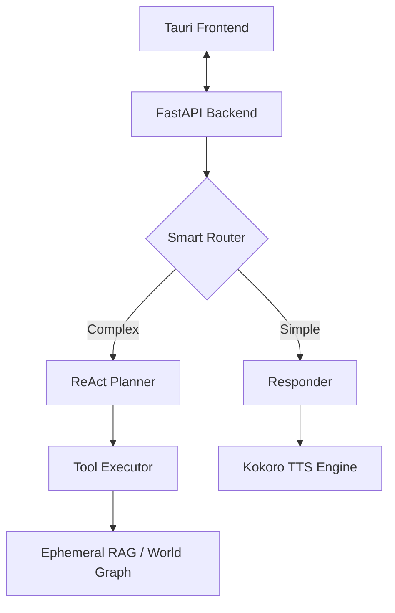

# 🌸 Sakura V19.5 — Forensic Reliability & Restoration

**The Ultimate Production-Ready Personal AI Assistant.**
*Tauri + Svelte (Frontend) | FastAPI + LangChain (Backend)*


---

## ✨ Why Sakura?

Sakura is not just a chatbot; it's a **Cognitive Operating System** for your desktop. It bridges the gap between high-level reasoning and physical system control.

### 🧠 Cognitive Architecture
- **Stable Soul (V16.2)**: Reactive Identity + EventBus + Dependency Injection for rock-solid state management.
- **Memory Judger (V4+)**: LLM-based importance filtering and temporal decay (30-day half-life).
- **DesireSystem (V15)**: CPU-based mood tracking (social battery & loneliness).
- **Proactive Intelligence**: Reaches out when lonely, but respects your focus (Bubble-Gate UX).

### 🛠️ Physical Capabilities
- **54+ Integrated Tools**: Gmail, Calendar, Spotify, Notes, Vision, RAG, Code, and System control.
- **Code Interpreter (V13)**: Secure execution of Python code in Docker sandboxes.
- **AI Vision (V18)**: High-performance screenshot and image analysis via Llama-4 Scout.
- **Voice Synthesis (V19.5)**: Ultra-responsive Kokoro TTS with **Keep-Warm** strategy (sub-2s latency).

### 🧬 Multi-Model Intelligence
- **Dynamic Routing**: Automatic selection between DIRECT, PLAN, and CHAT paths.
- **Model Abstraction**: Granular stage assignment (Router, Planner, Responder, Verifier).
- **DeepSeek Integration**: First-class support for DeepSeek V3/V4 with strict ID validation.
- **Execution Budgets**: Request-scoped LLM call limits (6 calls) to prevent runaway costs.

---

## 🚀 Quick Start (Windows)

### 1. Prerequisites
Ensure you have the following installed:
- [Python 3.11+](https://www.python.org/downloads/)
- [Node.js 18+](https://nodejs.org/)
- [Rust & Cargo](https://rustup.rs/)
- [FFmpeg](https://www.ffmpeg.org/download.html) (Optional, for Audio Tools)

### 2. Automated Setup
```powershell
# Clone the repository
git clone https://github.com/chande-dhanush/Sakura.git
cd Sakura

# Run the setup script (as Administrator)
.\scripts\setup.ps1
```

### 3. Launch
The Sakura dev environment handles sidecar bypass and auto-reloading.
```powershell
cd frontend
npm run tauri dev
```

---

## 🔑 Configuration

Sakura features a built-in **Setup Screen** for first-time configuration. Simply launch the app and navigate to the Setup tab to configure:
- **API Keys**: Groq, DeepSeek, Google, Tavily.
- **Identity**: Your name, assistant name, and personality traits.
- **Providers**: Stage-specific model overrides.

Alternatively, you can manually edit the `.env` file in the root directory.

---

## 🌸 What's New in V19.5?

V19.5 is the **Forensic Reliability Update**, focusing on eliminating execution regressions and restoring full-stack stability.

- **Forensic Relabeling**: Purged "Planner" span leakage from CHAT routes by explicitly relabeling memory compression stages.
- **Keep-Warm TTS**: Eliminated the 10s delay on manual speaker-button clicks by persisting the Kokoro model in memory.
- **Telemetry Attribution**: Fixed orphaned trace logs by propagating `trace_id` through all background tasks and LLM wrappers.
- **Tauri Asset Fix**: Resolved "Asset Protocol Access Denied" errors for local audio playback in development mode.
- **Hallucination Purge**: Removed all residual references to hallucinated tools like `query_memory`.
- **Reliability Hardening**:
    - Added uncertainty-aware execution (LOW_CONFIDENCE propagation).
    - Reduced hallucinations with strict abstention behavior ("no guessing").
    - Improved tool reliability with sanity checks and one-shot retry logic.
    - Enhanced query handling for ambiguous inputs (e.g., weather without location).
- **Voice & Setup Hardening (V19.5)**:
    - **openWakeWord**: Replaced legacy DTW with ONNX-accelerated "Sakura" wake word.
    - **Self-Contained Deployment**: Integrated `first_run_setup.py` for automated model downloads.
    - **Zero-Latency TTS**: Implemented "Keep-Warm" strategy for Kokoro (sub-2s responses).
    - **Unified Audio**: Migrated to `sounddevice` + `pygame` for robust cross-platform playback.
    - **MSI Ready**: Optimized Tauri bundle configuration for production Windows installs.
---

## ⌨️ Keyboard Shortcuts

| Shortcut | Action |
|----------|--------|
| `Alt + S` | Toggle Quick Search (Omnibox) |
| `Alt + F` | Toggle Full Window |
| `Alt + M` | Toggle Hide Mode (for movies) |
| `Escape` | Terminate current AI generation |
| Say "Sakura" | Voice activation (requires `first_setup.py`) |

---

## 🏗️ Technical Architecture



---

## 🛡️ Documentation & Security
For deep-dives into architecture and safety protocols, refer to:
- [DOCUMENTATION.md](docs/DOCUMENTATION.md) — Full API & Schema reference.
- [FIX_LOG.md](docs/FIX_LOG.md) — Historical forensic bug reports.

---

<p align="center">
  Built with ❤️ by <a href="https://github.com/chande-dhanush">Dhanush</a>
</p>
