# Sakura V15.2.1 — Technical Documentation
*System Certified: January 16, 2026*

---

## 🎯 Overview
**Sakura** is a production-grade personal AI assistant optimized for cost, performance, and CPU-only deployment.
**V15.2.1 Upgrade:** Now featuring **Cognitive Architecture** (DesireSystem, ProactiveScheduler), **Bubble-Gate UX** (socially aware interruptions), **Zero-Cost Mood Injection**, and **Reactive UI Themes**.

**Tech Stack:** Tauri + Svelte (frontend), FastAPI + LangChain (backend), multi-model LLM support (Groq, Gemini).

---

## ✨ Feature Matrix

| Feature | Version | Description |
|---------|---------|-------------|
| World Graph | V7+ | Single source of truth for identity, memory, context |
| EQ Layer | V7+ | Frustration/urgency detection, mood-aware responses |
| Self-Check Guard | V7+ | Validates responses against graph identity |
| Iterative ReAct Loop | V8+ | Plan → Execute → Observe → Replan (max 5 turns) |
| Ephemeral RAG | V8+ | Session-scoped document memory with Chroma |
| Hard 4-LLM Call Limit | V5+ | Circuit breaker prevents runaway costs |
| Multi-LLM Failover | V5+ | Groq → Gemini cascade with timeout protection |
| Memory Judger | V4+ | LLM-based importance filtering |
| 54 Tools | V13 | Gmail, Calendar, Spotify, Notes, Vision, RAG, Code, Audio |
| Kokoro TTS | V10+ | Neural voice synthesis with idle unload |
| Wake Word Detection | V10+ | Custom DTW-based voice activation |
| Smart Router | V10+ | DIRECT/PLAN/CHAT classification with tool hints |
| DIRECT Fast Lane | V10+ | Skip Planner+Verifier for single-tool actions |
| Tool Cache | V10+ | TTL-based cache for weather, search, etc. |
| Tauri UI | V10+ | Native desktop app with Svelte frontend |
| SSE Streaming | V10+ | Real-time token streaming via FastAPI |
| Thought Stream | V12+ | Real-time WebSocket reasoning feed for UI |
| Code Interpreter | V13 | Execute Python in Docker sandbox |
| Temporal Decay | V13 | Memory confidence decays over time (30-day half-life) |
| Unified ReflectionEngine | V14 | Background constraint detection (saves 1 LLM call) |
| Sleep Cycle | V14 | Startup fact crystallization with 24h cooldown |
| DesireSystem | V15 | CPU-based mood tracking (social_battery, loneliness) |
| ProactiveScheduler | V15 | Autonomous check-ins when lonely (0 daytime LLM cost) |
| Mood Injection | V15 | Responder adapts tone based on internal state |
| Pre-Computed Initiations | V15 | 3 AM icebreaker generation for next-day use |
| **Bubble-Gate** | **V15.2** | Respects UI visibility — won't interrupt when hidden |
| **Message Queue (TTL)** | **V15.2** | Queues proactive messages for 2h when hidden |
| **CPU Guard** | **V15.2** | Skips TTS when CPU > 80% to prevent stutter |
| **Reactive Themes** | **V15.2** | UI colors shift based on mood (5 palettes) |

---

## 🏗️ Architecture


### Component Overview

| Layer | Components | Purpose |
|-------|------------|--------|
| **Tauri Shell** | Window Manager, Hotkeys | Native desktop experience |
| **FastAPI Backend** | server.py, SSE endpoints | API and streaming |
| **World Graph** | EntityNode, ActionNode | Identity and context memory |
| **LLM Pipeline** | Router, Planner, Executor | Query processing |
| **Memory Layer** | Chroma, FAISS, Judger | Persistent storage |

---

## 🔀 Routing System (V10)

V10 introduces a 4-layer routing funnel for optimal latency.

### Layer Overview

| Layer | Component | Action |
|-------|-----------|--------|
| 0 | `forced_router.py` | Regex patterns → Execute immediately (0ms) |
| 1 | Smart Router (8B) | Classify → DIRECT, PLAN, or CHAT |
| 2 | DIRECT path | Cache check → Single tool → Skip Planner/Verifier |
| 3 | PLAN path | Full ReAct loop with Planner (70B) |

### Route Classifications

| Route | Description | LLM Calls |
|-------|-------------|-----------|
| CHAT | Pure conversation | 1 (Router) + 1 (Responder) |
| DIRECT | Single obvious tool | 1 (Router) + 1 (Tool) + 1 (Responder) |
| PLAN | Multi-step or research | 1 (Router) + N (Planner) + 1 (Verifier) + 1 (Responder) |

### Cache TTLs

```python
CACHE_TTL = {
    "get_weather": 1800,      # 30 mins
    "web_search": 86400,      # 24 hours
    "get_news": 3600,         # 1 hour
    "define_word": 604800,    # 7 days
}
```

---

## 🔄 ReAct Loop

The iterative reasoning loop for complex queries.


### Protections
| Protection | Description |
|------------|-------------|
| Goal Reminder | Original query injected each iteration |
| History Cap | Last 5 items only (prevents token explosion) |
| Smart Pruner | JSON-aware truncation (preserves valid syntax) |
| Summarization | LLM summarizes outputs >2000 chars |

---

## 🧠 World Graph

The **single source of truth** for identity, memory, and context.

### Components

| Component | Purpose |
|-----------|---------|
| `EntityNode` | Things that exist (user, songs, topics) with lifecycle |
| `ActionNode` | Things that happened (tool calls) with focus_entity |
| `ResolutionResult` | Multi-hypothesis reference resolution |

### Entity Lifecycle

```mermaid
stateDiagram-v2
    [*] --> EPHEMERAL
    EPHEMERAL --> CANDIDATE : ref_count ≥ 2
    EPHEMERAL --> [*] : garbage collected
    CANDIDATE --> PROMOTED : ref_count ≥ 3 or user_stated
    CANDIDATE --> EPHEMERAL : stale (7 days)
    PROMOTED --> PROMOTED : protected forever
    
    note right of EPHEMERAL : Temporary mentions
    note right of CANDIDATE : Awaiting confirmation
    note right of PROMOTED : Trusted, searchable
```



### EQ Layer (Emotional Intelligence)

| Intent | Triggers | Response Adjustment |
|--------|----------|---------------------|
| FRUSTRATED | "no", "wrong", "ugh" | Be extra helpful |
| URGENT | "now", "quick", "asap" | Be concise |
| CURIOUS | Questions ("what?") | Elaborate freely |
| PLAYFUL | "lol", "haha" | Match energy |
| TASK_FOCUSED | "play", "open" | Be efficient |

### System Invariants
1. `user:self` immutable to tools
2. LLM_INFERRED never auto-promoted
3. External search banned when `is_user_reference=True`
4. Every mutation logs source

---

## 🔧 Tools (46)

### Tool List

| # | Tool | Description |
|---|------|-------------|
| 1 | `spotify_control` | Play/Pause/Next/Previous music |
| 2 | `play_youtube` | Play video/audio on YouTube |
| 3 | `web_search` | Tavily-powered web search |
| 4 | `web_scrape` | Scrape website with auto-RAG offload |
| 5 | `read_screen` | Screenshot + Gemini Vision analysis |
| 6 | `gmail_read_email` | Read emails with filters |
| 7 | `gmail_send_email` | Send emails |
| 8 | `calendar_get_events` | Fetch calendar events |
| 9 | `calendar_create_event` | Create events |
| 10 | `tasks_list` | List Google Tasks |
| 11 | `tasks_create` | Create Google Task |
| 12 | `note_create` | Create markdown note |
| 13 | `note_append` | Append to note |
| 14 | `note_read` | Read note content |
| 15 | `note_list` | List notes in folder |
| 16 | `note_open` | Open note in editor |
| 17 | `note_delete` | Delete note (with backup) |
| 18 | `note_search` | Search notes by keyword |
| 19 | `file_read` | Read local file |
| 20 | `file_write` | Write local file |
| 21 | `file_open` | Open file with default app |
| 22 | `open_app` | Open desktop application |
| 23 | `clipboard_read` | Read clipboard content |
| 24 | `clipboard_write` | Write to clipboard |
| 25 | `get_system_info` | System info (time, date, battery) |
| 26 | `get_weather` | Weather via wttr.in |
| 27 | `set_timer` | Windows-native timer (Toast + Sound) |
| 28 | `set_reminder` | Schedule future reminders |
| 29 | `volume_control` | System volume control |
| 30 | `currency_convert` | Currency conversion |
| 31 | `quick_math` | Safe calculator (sympy) |
| 32 | `define_word` | Dictionary lookup |
| 33 | `get_news` | Google News RSS headlines |
| 34 | `get_location` | IP-based location |
| 35 | `search_wikipedia` | Wikipedia summary |
| 36 | `search_arxiv` | Scientific paper search |
| 37 | `update_user_memory` | Store user facts/preferences |
| 38 | `ingest_document` | Ingest document to RAG |
| 39 | `fetch_document_context` | RAG document search (long-term) |
| 40 | `list_uploaded_documents` | List ingested docs |
| 41 | `delete_document` | Remove document from RAG |
| 42 | `get_rag_telemetry` | RAG system stats |
| 43 | `trigger_reindex` | Force RAG reindexing |
| 44 | `retrieve_document_context` | Query ephemeral RAG by doc_id |
| 45 | `forget_document` | Delete specific ephemeral doc |
| 46 | `clear_all_ephemeral_memory` | Wipe all session docs |
| 47 | `research_topic` | Multi-step deep research |
| 48 | `query_ephemeral` | Query intercepted large outputs |

### Tool Categories

```python
TOOL_GROUPS = {
    "music": ["spotify_control", "play_youtube"],
    "search": ["web_search", "web_scrape", "search_wikipedia", "search_arxiv"],
    "email": ["gmail_read_email", "gmail_send_email"],
    "calendar": ["calendar_get_events", "calendar_create_event"],
    "tasks": ["tasks_list", "tasks_create"],
    "notes": ["note_create", "note_append", "note_read", "note_list", "note_open", "note_delete", "note_search"],
    "files": ["file_read", "file_write", "file_open"],
    "system": ["read_screen", "open_app", "volume_control", "get_system_info", "clipboard_read", "clipboard_write"],
    "utility": ["get_weather", "set_timer", "set_reminder", "currency_convert", "quick_math", "define_word", "get_news", "get_location"],
    "memory": ["update_user_memory", "ingest_document"],
    "rag": ["fetch_document_context", "list_uploaded_documents", "delete_document", "get_rag_telemetry", "trigger_reindex"],
    "ephemeral_rag": ["retrieve_document_context", "forget_document", "clear_all_ephemeral_memory"],
}
```

---

## 💾 Memory System

### Memory Layers

| Layer | Storage | Purpose |
|-------|---------|---------|
| World Graph | JSON | Identity, entities, actions, focus |
| Chroma (Long-Term) | Per-Doc Dirs | Permanent document RAG |
| Chroma (Ephemeral) | Per-Doc Dirs | Session-scoped document RAG |
| Memory Judger | LLM (8B) | Importance filtering |
| FAISS | Memory-mapped | Conversation history vectors |
| Episodic Memory | JSON | Significant events (keyword search) |

### Ephemeral RAG Flow


---

## 🎨 UI & Voice Architecture

### Hybrid Rust+Python Load Order
1. Tauri spawns `server.py` with `--voice` flag
2. Polls `http://127.0.0.1:8000/health` (15s timeout)
3. Initializes WebView only after backend confirms `200 OK`

### Window Modes

| Window | Size | Behavior |
|--------|------|----------|
| Bubble | 220x220 | Transparent, always-on-top, bottom-right |
| Main | 480x640 | Hidden by default, shows on interaction |

### Voice Integration
- **Wake Word:** "Sakura" (DTW detection via `wake_word.py`)
- **TTS:** Kokoro neural synthesis with idle unload
- **Manual Trigger:** Speaker button in chat → `/voice/speak`

### Hard Quit
- Rust `force_quit` command sends `SIGTERM` to Python
- Calls `std::process::exit(0)` immediately
- Bypasses potential HTTP shutdown hangs

---

## 🛡️ Security

### Path Sandboxing
- Blocks: `C:/Windows`, `Program Files`, `AppData`
- Prevents parent traversal (`../`)
- Restricts to project root + Documents/Desktop/Downloads

### Safe Math
- Replaced `eval()` with `sympy.sympify()` + whitelist
- No arbitrary code execution

### API Authentication
- `X-Auth` header with SHA256 comparison
- Timing-attack resistant

### Identity Protection
- `user:self` entity immutable to tools
- LLM-inferred facts never auto-promoted

---

## ⚡ Performance

### Timeout Protection

| Component | Timeout | Fallback |
|-----------|---------|----------|
| LLM calls | 60s | Gemini backup |
| Verifier | 15s | Default to PASS |
| RAG retrieval | 30s | Continue without context |

### Multi-Model Failover

| Stage | Primary | Backup |
|-------|---------|--------|
| Router | Llama 3.1 8B (Groq) | Gemini 2.0 Flash |
| Planner | Llama 3.3 70B (Groq) | Gemini 2.0 Flash |
| Verifier | Llama 3.1 8B (Groq) | Gemini 2.0 Flash |
| Responder | GPT OSS 20B | Gemini 2.0 Flash |

### Token Savings

| Query Type | Before | After | Savings |
|------------|--------|-------|---------|
| Music | ~800 | ~115 | 86% |
| Complex Plan | ~5000 | ~950 | 81% |
| History | O(n) | O(1) | Flat cost |

---

## 📋 Test Suite

| Test File | Coverage |
|-----------|----------|
| `test_world_graph.py` | World Graph core, EQ layer, compression |
| `test_agent_state.py` | Rate limit, reset, hindsight |
| `test_api_auth.py` | Authentication, timing attacks |
| `test_router.py` | Intent classification |
| `test_executor.py` | Tool execution |
| `test_responder.py` | Response generation, guardrails |
| `test_sandboxing.py` | Path validation security |
| `test_quick_math_security.py` | Safe math evaluation |
| `test_container.py` | Dependency injection |
| `memory/test_chroma_*.py` | Ingestion, retrieval, isolation |

---

## 🛡️ RAG Audit Certification (V12)
**Date:** January 13, 2026

| Component | Score | Status |
|-----------|-------|--------|
| **Web RAG** | 1.0/1.0 | ✅ Perfect accuracy |
| **Document RAG** | 1.0/1.0 | ✅ Perfect isolation & retrieval |
| **Memory RAG** | 0.67/1.0 | ⚠️ Nuance failure (Fixed in V12.1) |

*Audit conducted using LLM-as-a-Judge (Llama 3 70B).*

---

## 📁 Project Structure

```
sakura-v10/
├── backend/                        # Core Backend Service
│   ├── sakura_assistant/           # Core Python logic
│   │   ├── config.py               # Configuration & personality
│   │   ├── core/
│   │   │   ├── llm.py              # SmartAssistant facade
│   │   │   ├── router.py           # Intent classification
│   │   │   ├── executor.py         # Tool execution + ReAct
│   │   │   ├── responder.py        # Response generation
│   │   │   ├── planner.py          # Token-optimized planner
│   │   │   ├── world_graph.py      # World Graph (1700+ lines)
│   │   │   ├── container.py        # Dependency injection
│   │   │   ├── voice_engine.py     # Background voice loop
│   │   │   └── scheduler.py        # Background tasks
│   │   ├── memory/
│   │   │   ├── chroma_store/       # Long-term + ephemeral RAG
│   │   │   └── faiss_store/        # Conversation history
│   │   ├── utils/
│   │   │   ├── tts.py              # Kokoro TTS
│   │   │   ├── wake_word.py        # DTW detection
│   │   │   ├── logging.py          # Structured logging
│   │   │   └── metrics.py          # Prometheus endpoint
│   │   └── tests/                  # Test suite (17 files)
│   ├── server.py                   # FastAPI entry point
│   ├── first_setup.py              # Setup wizard
│   ├── Dockerfile                  # Container build
│   └── requirements.txt            # Python dependencies
│
├── frontend/                       # Tauri + Svelte UI
│   ├── src/                        # Svelte components
│   ├── src-tauri/
│   │   ├── src/lib.rs              # Rust shell
│   │   └── tauri.conf.json         # Window config
│   └── package.json
│
├── setup.ps1 / setup.sh            # Automated installers
├── toggle_startup.ps1 / .sh        # Autostart toggle
├── uninstall.ps1 / .sh             # Clean removal
├── docker-compose.yml              # Container orchestration
├── .env.example                    # API key template
└── DOCUMENTATION.md                # This file
```

---

## 🐳 Docker Deployment

### Build and Run

```bash
# Build backend image
docker build -t sakura-backend ./backend

# Run with docker-compose
docker-compose up -d

# View logs
docker-compose logs -f backend
```

### Environment Variables

| Variable | Required | Description |
|----------|----------|-------------|
| `GROQ_API_KEY` | ✅ | Groq API for LLM calls |
| `GOOGLE_API_KEY` | ✅ | Google Gemini (fallback) |
| `TAVILY_API_KEY` | ⬜ | Web search tool |

### Volumes

| Volume | Purpose |
|--------|---------|
| `./backend/data:/app/data` | Persist World Graph, history |
| `./.env:/app/.env:ro` | API keys (read-only) |

> **Note:** Docker mode disables `open_app` and `read_screen` tools.

---

## 🔧 System Reset

Complete data wipe (preserves source code):

```bash
cd backend
python tools/system_reset.py
```

**Requires:** Type "RESET" to confirm.

**Deletes:**
- Conversation history
- World Graph
- Chroma/FAISS stores
- Episodic memory

**Preserves:**
- `.env`, `config.json`, `credentials.json`
- Source code
- Notes/ folder

---

## 📝 Version History

| Version | Key Changes |
|---------|-------------|
| V4 | Frozen pipeline, Memory Judger, FAISS mmap |
| V5 | Verifier loop, 4-LLM limit, hindsight retry |
| V6 | Conversation state tracker (deprecated) |
| V7 | World Graph, EQ Layer, self-check, focus entity |
| V8 | Iterative ReAct Loop, Ephemeral RAG, Citation Support |
| V9 | Smart Pruner, Multi-Action Router, Config-Driven Tools |
| V9.1 | Token Diet (15-tool cap), WordGraph Retention, Summarization |
| **V10** | Smart Router, DIRECT Fast Lane, Tool Cache, Tauri UI |
| **V10** | Smart Router, DIRECT Fast Lane, Tool Cache, Tauri UI |
| **V10.1** | File Upload, Terminal Action Guard, Window Auto-Show |
| **V10.4** | Flight Recorder, Async LLM, Token Bucket Rate Limits |
| **V11** | Smart Research, Context Valve, Reflection Engine |
| **V12** | WebSocket Thought Stream, Native Logs, RAG Certification |

---

*Documentation updated for Sakura V10.1 — January 2026*
