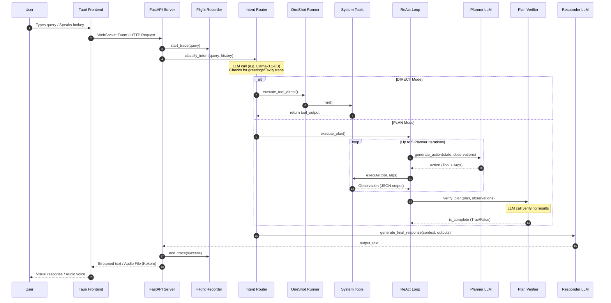
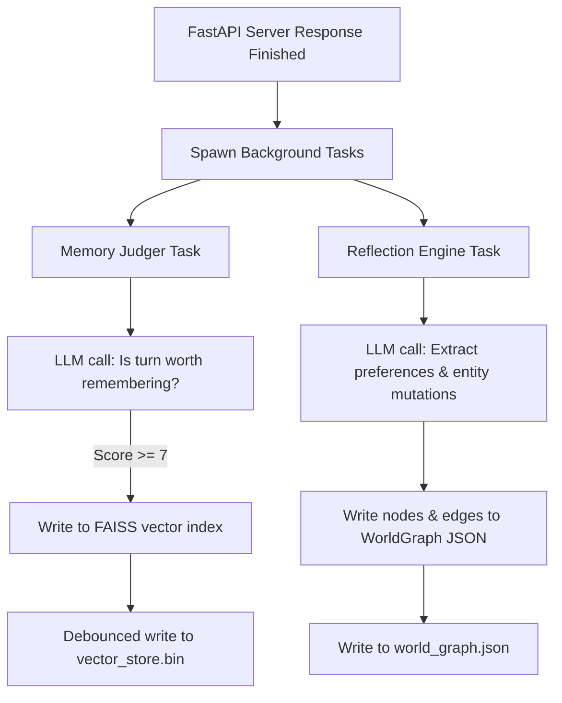

# Sakura Legacy Current Execution Flow

This document details the step-by-step request lifecycle and planning pipelines in Sakura V19.5/V20.0.

## 1. Request Lifecycle Overview

## 2. Background Reflection Execution

Parallel to the main response cycle, after the FastAPI server responds to the client, the following asynchronous task flow triggers:

