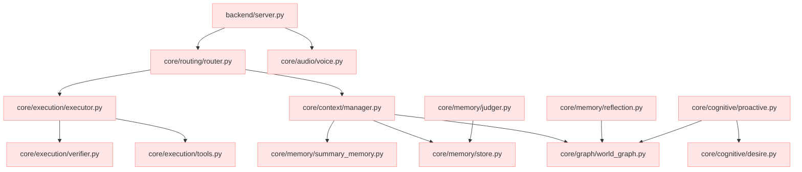

# Sakura Legacy System Dependency Map

This document outlines the dependencies and import relations of the Sakura V19.5/V20.0 assistant backend before the Sakura Lite refactor.

## 1. Architectural Layers & Coupling

## 2. Dependency Directory Matrix

| Module | Location | Primary Dependencies | Coupling Level |
| :--- | :--- | :--- | :--- |
| **Server / Entrypoint** | `backend/server.py` | `core/routing/router.py`, `utils/flight_recorder.py`, FastAPI | High |
| **Intent Router** | `backend/sakura_assistant/core/routing/` | `core/context/manager.py`, `core/execution/executor.py`, Groq/Gemini client | High |
| **Execution Loop** | `backend/sakura_assistant/core/execution/` | `core/execution/tools.py`, `core/execution/verifier.py`, `utils/flight_recorder.py` | Critical |
| **Context Manager** | `backend/sakura_assistant/core/context/` | `core/graph/world_graph.py`, `memory/memory_coordinator.py`, `utils/flight_recorder.py` | High |
| **Memory / Graph** | `backend/sakura_assistant/core/graph/` | `sqlite3` (actions), JSON-files (entities), standard library | Medium-High |
| **Vector Memory** | `backend/sakura_assistant/core/memory/` | `faiss`, `sentence_transformers`, `numpy`, JSON files | High |
| **Proactive / Desire** | `backend/sakura_assistant/core/cognitive/`| `core/graph/world_graph.py`, standard math library | Medium |
| **Observability** | `backend/sakura_assistant/utils/` | `json`, `time`, SSE websocket emitter | Low (Utility) |
