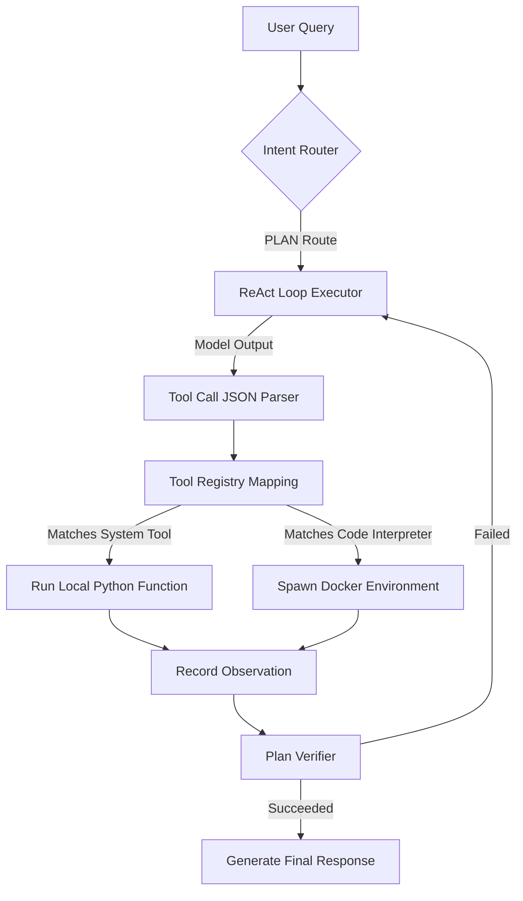

# Sakura Legacy Tool Execution Flow

This document details the tool registration, argument mapping, execution, sandboxing, and output tracing structure.

## 1. Tool Execution Pipeline



## 2. Component Directory Overview

*   **Registry & Mappings:**
    *   `core/execution/tools.py`: Contains definitions, JSON schemas, and registration logic for system tools (Clipboard, Spotify, Screen vision, System search, etc.).
    *   `core/execution/micro_toolsets.py`: Maps tool calls to custom helper scripts.
*   **Code Interpreter Sandboxing:**
    *   Runs execution blocks inside a dedicated Docker container wrapper, mapping directories and capturing stdout/stderr logs.
*   **Telemetry Hooking:**
    *   Each tool run is wrapped in a `FlightRecorder` span:
        ```python
        with span("ToolExecution", tool=tool_name, args=tool_args):
            # execution occurs here
        ```
*   **Apology Verification:**
    *   `PlanVerifier` runs a final LLM prompt to check if the tool output observation matches the expected plan results.
