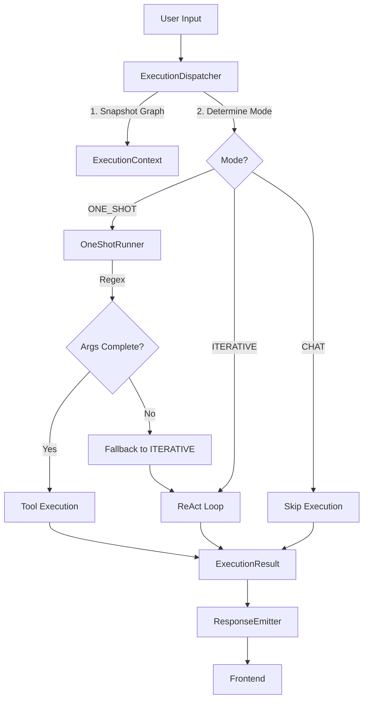

# Sakura V17 (v2.1) Progress Walkthrough - Day 1

> **Date:** January 19, 2026
> **Status:** Phase 1 (Core Infrastructure) & Phase 3 (Dispatcher) Partially Complete
> **Focus:** Hardening the core execution pipeline against production risks.

---

## 🚀 Achievements

We have successfully implemented the foundational "spinal cord" of the v2.1 architecture. These components directly address the 8 critical production risks identified in the review.

### 1. `ExecutionContext` & `GraphSnapshot` (The Source of Truth)
**File:** `core/execution_context.py`

- **Problem:** Execution modes were implicit/leaky, and accessing the live WorldGraph caused race conditions.
- **Solution:**
  - Created immutable `ExecutionContext` dataclass threaded through the entire pipeline.
  - Implemented `GraphSnapshot` to capture execution state at the start of a request (fixing race conditions).
  - Defined explicit `ExecutionMode` enum (CHAT, ONE\_SHOT, ITERATIVE).
  - Replaced boolean success with `ExecutionStatus` enum (SUCCESS, PARTIAL, FAILED, SKIPPED).

### 2. `ResponseEmitter` (The State Guard)
**File:** `core/response_emitter.py`

- **Problem:** Tool execution and responder could both try to emit messages, causing double-sends and UI desync.
- **Solution:**
  - Created a single authority for message emission.
  - Uses an internal state flag (`_emitted`) and `asyncio.Lock`.
  - Guarantees **exactly one** emission per request, regardless of where it happens (tool, timeout, or final response).

### 3. `OneShotRunner` (The Fast Lane)
**File:** `core/oneshot_runner.py`

- **Problem:** The original ONE\_SHOT design relied on LLMs for argument extraction, risking "planner creep" and latency.
- **Solution:**
  - Implemented a **Regex-Only** runner. NO LLM calls allowed.
  - Defined `EXTRACTABLE_TOOLS` (Spotify, Weather, Timer, etc.) with strict patterns.
  - **Fail-Fast Mechanism:** If regex extraction is incomplete, it immediately raises `OneShotArgsIncomplete`, triggering a fallback to the Planner.

### 4. `ExecutionDispatcher` (The Brain)
**File:** `core/execution_dispatcher.py`

- **Problem:** Blind trust in Router confidence scores and implicit mode selection.
- **Solution:**
  - Implemented **Deterministic Mode Selection**:
    - `CHAT` classification → `CHAT` mode.
    - `DIRECT` + Valid Tool + Extractable → `ONE_SHOT` mode.
    - Everything else → `ITERATIVE` mode (safe fallback).
  - Explicitly wraps the execution flow in the new `ExecutionContext`.
  - **Async-Only:** Removed all synchronous `run_until_complete` wrappers from the core logic.

---

## 🧩 Architectural Diagram (Current State)

---

## 📋 Next Steps (Tomorrow)

We are positioned to integrate these components into the main `SmartAssistant` class.

1.  **Refactor `SmartAssistant` (`llm.py`)**:
    - Remove old executor logic.
    - Integrate `ExecutionDispatcher`.
    - Implement the `finally` block for guaranteed `ResponseEmitter` usage.
2.  **Update `ReActLoop`**:
    - Enforce `ExecutionContext` usage.
    - Implement `final: true` terminal logic.
3.  **De-bloating**:
    - Begin splitting `WorldGraph` and organizing `config.py`.

---

*Verified by: Antigravity*
